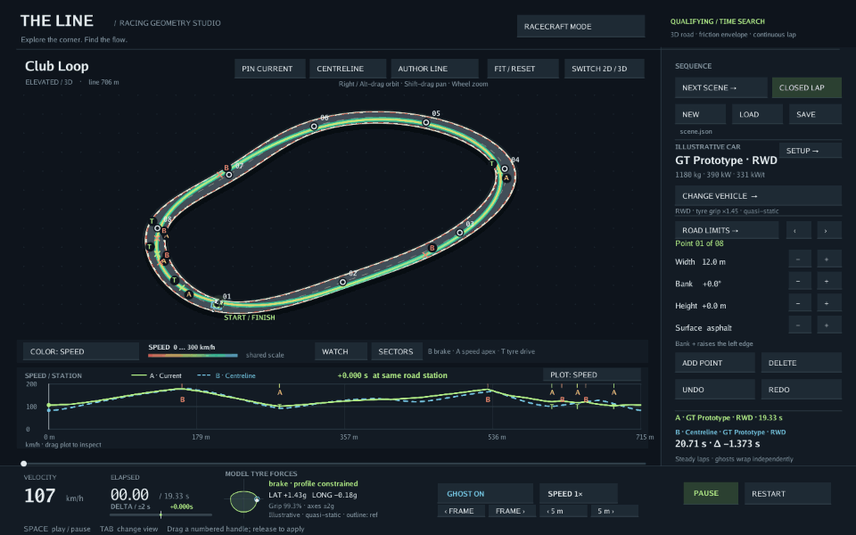

# The Line

A racing-line playground for curious driving enthusiasts. Reshape a corner, tweak the car, and watch how the line, braking points and lap time change. Explore twelve fictional tracks, from hairpins and rally sections to a continuous club circuit. Switch from qualifying to two-car racecraft to explore inside defence, over-under moves, and pass/repass battles.



## Get running

Install [Go 1.24 or later](https://go.dev/dl/) and Git. You’ll need a graphical desktop.

<details>
<summary>Platform setup: macOS and Linux</summary>

On macOS, install Apple’s command-line tools if you haven’t already:

```sh
xcode-select --install
```

On Ubuntu or Debian, install the build and graphics dependencies:

```sh
sudo apt-get update
sudo apt-get install build-essential libgl1-mesa-dev libx11-dev libxcursor-dev libxi-dev libxinerama-dev libxrandr-dev libxxf86vm-dev
```

Other Linux distributions need the equivalent OpenGL and X11 development packages.

</details>

Then open a terminal and run:

```sh
git clone https://github.com/TheFellow/the-line.git
cd the-line
go run ./main/gui
```

The first launch downloads dependencies and builds the app. It opens on the esses, ready to edit.

To start on the circuit shown above:

```sh
go run ./main/gui --preset club-loop --vehicle gt
```

## Try this first

1. **Reshape a corner.** Drag a numbered road handle and release. The line recalculates; use the sidebar to change width, banking or elevation.
2. **Change the car.** Open **Setup** and try more power, different grip or extra weight. Watch where the new setup gains or loses time.
3. **Compare your changes.** Click **Pin current** before a setup edit to keep the old run as a reference ghost. Drag the speed chart to inspect a corner; a negative time delta means your current line is ahead.
4. **Try your own line.** Click **Author line**, then drag the cyan handles. See how your choice compares with the computed line.
5. **Sit back and watch.** Press **Space** to pause or resume, **Tab** to switch views, or **Watch** for the trackside camera. **Next scene** cycles through the tracks.

Scroll to zoom, Shift-drag to pan, and right-drag to orbit the elevated view. **Fit / Reset** brings the track back into view.

Use **Cmd/Ctrl+Z** to undo. Click the file path to choose a save location, then **Cmd/Ctrl+S** to save your study or **Cmd/Ctrl+O** to load it.

## Try two-car racecraft

Click **Racecraft mode** or press **R**. The green **A** car starts ahead; amber
**B** attacks. Both cars occupy real space in the experiment, with conservative
body clearance checked throughout the run.

- **Over-under:** A defends the inside; B cuts back and wins on exit.
- **Pass-repass:** B passes inside; A recovers with a faster exit.
- **Defend:** more starting distance lets A hold position on the same hairpin.
- **Esses duel:** side-by-side placement trades the advantage across successive bends.

**Load next example** replaces the race road, car and controls with a preset.
Use **+ / −** to change starting gap, B's entry-cap delta, lateral separation,
or extra body clearance. The cap delta applies at station zero; A starts farther
along its path, so check the displayed realized starting speeds when comparing runs.
Watch both speed traces and the signed position gap; a pass marker appears when
the new leader is a full car length ahead. Drag the timeline, press **, / .** to
step, or change playback speed to examine the crossover. **Save race / Load race**
preserve the complete experiment in `racecraft.json`. **R** returns to your
qualifying study, cancelling a pending race plan if needed.

These are computed tactical experiments with authored intentions and a finite
choice of alternative lines. Changing the inputs can prevent a pass or leave no
safe plan; rejected edits retain the last valid race. Entry speeds are caps, and
the replay ends when the first car finishes. See the [racecraft design and
examples](docs/RACECRAFT.md) for assumptions and measured outcomes.
The panel separates a guaranteed clearance bound from a sampled closest gap.

Start directly or export without a graphical desktop:

```sh
go run ./main/gui --mode racecraft --scenario pass-repass
go run ./main/gui --race-file examples/racecraft/over-under.json
go run ./main/cli race --scenario over-under --gap 7 --format csv --out race.csv
go run ./main/cli race --scenario pass-repass --format gif --view 3d --out race.gif
```

Rebuild the preview above with `go run ./tools/preview`. It contains qualifying,
over-under, and pass/repass clips rendered by the same code as the live studio.
The [implementation research](research/RACECRAFT_IMPLEMENTATION.md),
[Claude CLI critique](research/CLAUDE_RACECRAFT_CRITIQUE.md), and
[review response](research/RACECRAFT_CRITIQUE_RESPONSE.md) record the model,
independent findings and subsequent fixes.

For more, see [line studies](docs/LINE_STUDIES.md), [car setup](docs/SETUP.md), and [track editing](docs/TRACK_AUTHORING.md).

The cars and tracks are fictional, and the results are estimates from a simplified vehicle model. See [model assumptions](docs/VEHICLE_MODEL.md) for the details.
